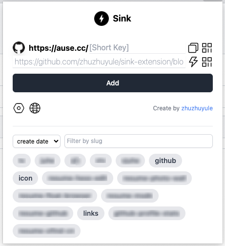
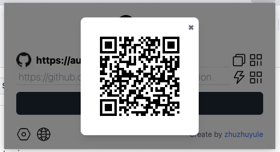
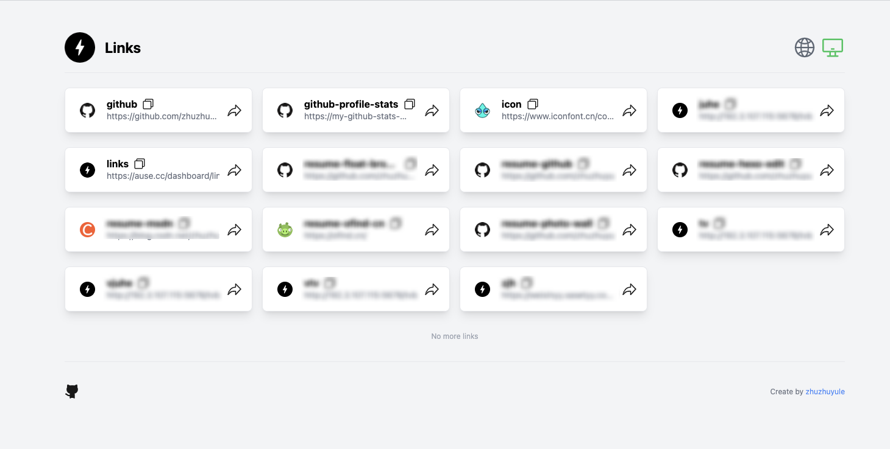

Language: :us:
<a title="Chinese" href="doc/cn/README.md">:cn:</a>

<h1 align="center">🔗 Sink Short URL Extension</h1>

This is a Chrome extension that allows for quick generation and preview of short links using [Sink](https://github.com/ccbikai/Sink).

### ✨ Features

* Instantly shorten the current webpage URL into a Sink short link.
* Customizable short link suffix.
* Preview shortened links with quick copy functionality.
* Log in to your Sink account to manage generated short links.

### ☀️ Screenshots

#### Popup Page

#### QRCode Page

#### Setting Page

### 🚀 Usage

1. Install Sink service: refer to [https://github.com/ccbikai/Sink](https://github.com/ccbikai/Sink)
2. Install the extension into the Chrome browser.
3. Navigate to the webpage you want to shorten.
4. Click the extension icon, customize the short link suffix (optional).
5. Click the generate button, preview, and copy the short link.

### 🛠️ Tech Stack

* **Preact:** Lightweight UI library for building user interfaces.
* **TypeScript:** Adds type checking for better readability and maintainability.
* **Vite:** Fast development server and build tool.
* **Tailwind CSS:** Utility-first CSS framework for building modern interfaces.
* **ESLint:** Code style checker to ensure code quality.
* **Prettier:** Code formatter to maintain consistent style.
* **Jest:** JavaScript testing framework for unit and integration tests.
* **Chrome Extension Manifest Version 3:** The latest version of Chrome Extension spec.

### 🤝 Contributing

Feel free to submit issues and pull requests!

### 📄 License

Distributed under the [MIT License](https://github.com/zhuzhuyule/skin-extension/LICENSE).

